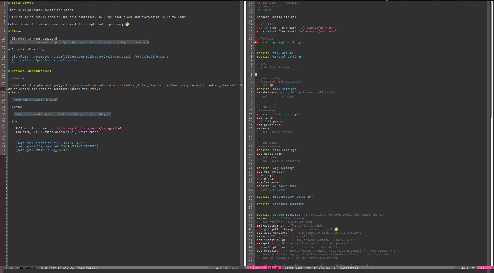

# Emacs config

This is my personal config for emacs.

I try to do it really modular and self-contained, so I can just clone and everything is up to rock!

Let me know if I missed some auto-install or optional dependency =D

# Show me!

Ok, ok! This is how it looks like:



# Clone

- Directly in your .emacs.d
`git clone --recursive https://github.com/rockneurotiko/emacs.d.git ~/.emacs.d`

- In other directory
  ```
  git clone --recursive https://github.com/rockneurotiko/emacs.d.git ~/other/path/emacs.d
  ln -s ~/other/path/emacs.d ~/.emacs.d
  ```

# Optional dependencies:

- plantuml

  Download [the plantuml jar][https://sourceforge.net/projects/plantuml/files/plantuml.jar/download] to /opt/plantuml/plantuml.jar or change the path in settings/random-requires.el
- tern

  `sudo npm install -g tern`

- python

  `sudo pip install jedi flake8 importmagic autopep8 yapf`

- gcal

    Follow this to set up: https://github.com/myuhe/org-gcal.el
    And then, in ~/.emacs.d/tokens.el, write this:

    ```
    (setq gcal-client-id "YOUR_CLIENT_ID")
    (setq gcal-client-secret "YOUR_CLIENT_SECRET")
    (setq gcal-email "YOUR_EMAIL")
    ```
